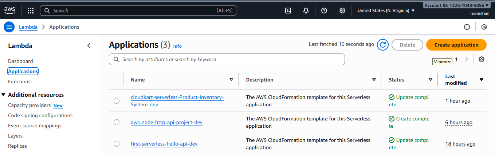
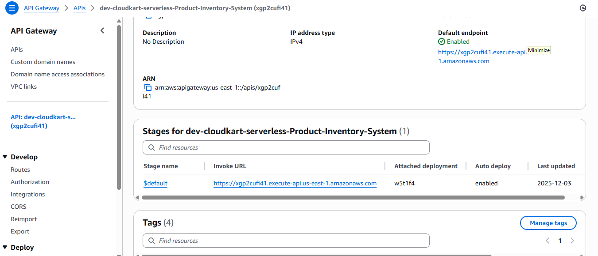

# CloudKart-Serverless-Product-Inventory-System
Serverless Product Inventory System (CloudKart) with AWS Lambda, API Gateway, DynamoDB, SQS, OpenSearch, and CloudWatch. Full CRUD APIs, real-time indexing, and structured logging. Version-controlled and deployed using Serverless Framework.

 # Overview
CloudKart is a serverless inventory management system that allows businesses to manage products efficiently without worrying about server maintenance. The system leverages AWS services to ensure scalability, reliability, and real-time performance.
 # Features
 ° Create, Read, Update, Delete (CRUD) APIs for product management
 
 ° Real-time product indexing with OpenSearch
 
 ° Serverless architecture using AWS Lambda and API Gateway
 
 ° DynamoDB for fast and scalable data storage
 
 ° SQS for asynchronous messaging
 
 ° CloudWatch logging and monitoring
 
 ° Fully deployable via Serverless Framework
 
 # Architecture
 
 # Installation & Setup
 
 1. Clone the Repository
    
# Bash commands

    git clone https://github.com/manisha677/CloudKart-Serverless-Product-Inventory-System.git
****

    cd CloudKart-Serverless-Product-Inventory-System
****

2. Install Dependencies

Ensure you have Node.js and npm installed. Then run:

    npm install
****

3. Configure AWS Credentials
   
Make sure AWS CLI is installed. Configure your credentials:

    aws configure
****

Provide your AWS Access Key, Secret Key, and Region (us-east-1).

4. Deploy the Serverless Application

****
    serverless deploy
 ****
 
This will deploy Lambda functions, API Gateway endpoints, and DynamoDB tables.

5. Get the API Endpoint
   
After deployment, your terminal will show something like:

****
    POST - https://<your-api-id>.execute-api.us-east-1.amazonaws.com/products
****

6. Test the API

****
    curl -X POST https://<your-api-id>.execute-api.us-east-1.amazonaws.com/products \
    -H "Content-Type: application/json" \
    -d '{"name":"Sample Product","price":100,"category":"Electronics"}'
****

7. Successful response example:

****

    {
    "message": "Product created",
    "data": {
    "id": "97e0f564-2174-4752-86f3-f7383301241d",
    "name": "Sample Product",
    "price": 100,
    "category": "Electronics",
    "createdAt": 1764753779859
    }
    }
**** 
# Usage

After deployment, you can test the APIs using:

****
    # Create a product
    curl -X POST https://<your-api-endpoint>/products \
    -H "Content-Type: application/json" \
    -d '{"name":"Sample Product","price":100,"category":"Electronics"}'
****

# Screenshots

1. AWS Lambda Function

This screenshot shows the deployed Lambda function used to handle product inventory logic.

| Preview | Screenshot |
|------------|---------|
| Lambda Function |  |
| Lambda Deployment Overview |  |

2. Amazon API Gateway

This screenshot shows the API Gateway used to expose Lambda as a REST API endpoint.

| Preview | Screenshot|
|------------|---------|
| API Gateway |  |
| Testing via terminal |  |

3. DynamoDB Table

This screenshot displays the DynamoDB table where product details are stored along with CRUD operations.

| Preview | Screenshot|
|------------|---------|
| Dynamodb table  |  |
| DynamoDB CloudWatch Active Table State|  |

4. CloudWatch Logs

This screenshot shows CloudWatch logs used to track Lambda executions and API request debugging.

| Preview | Screenshot |
|------------|---------|
| CloudWatch Log Output |  |

5. Deployment Status (Serverless Framework Output)

This screenshot shows the successful deployment of the application using the Serverless Framework, confirming that all AWS resources were created and configured properly.

| Preview | Screenshot |
|------------|---------|
| Deployment Successful Output |  |

6. API Testing Using Postman

This screenshot demonstrates the API being tested using Postman to verify that the deployed endpoints are working correctly and returning expected responses.

| Preview | Screenshot |
|------------|---------|
| Postman Test Result |  |

# Technologies Used

|Technology	| Purpose |
|Node.js	| Backend logic and API development |
|Serverless Framework	| Deployment and infrastructure automation |
|AWS Lambda	| Executes backend logic without servers |
|Amazon API Gateway	| Exposes REST API endpoints |
|Amazon DynamoDB | NoSQL database to store product records |
|AWS IAM Roles	| Secure permissions and access control |
|Postman |	API testing and validation |
|Git & GitHub	| Version control and project repository |
 7. Author
